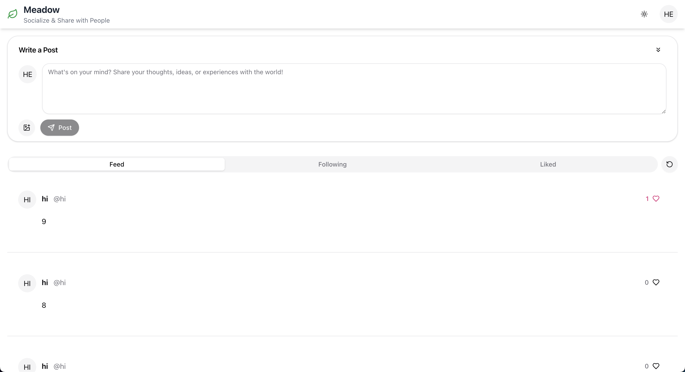
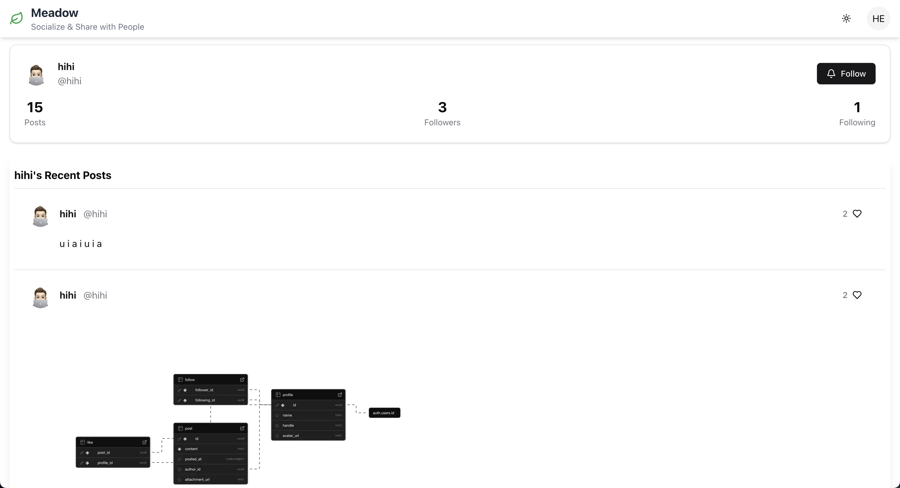

# Meadows - A Next.js Social Media 🍃

A full-featured social feed application built with Next.js, Supabase, and React Query. Meadows lets users create posts (with optional images), follow other users, like posts, and manage their profiles. It includes infinite scrolling, light/dark mode, and a responsive, mobile-friendly design.

<p align="center">
  
  
  
  
  
  
  
  
  
  
  
  
  
  
  
  
</p>

**Live Web App**: [https://meadows.vercel.app/](https://meadows.vercel.app/)

---

## Table of Contents

1. [Features](#features)
2. [Tech Stack](#tech-stack)
3. [Getting Started](#getting-started)
4. [Environment Variables](#environment-variables)
5. [Project Structure](#project-structure)
6. [Key Components](#key-components)
7. [Scripts](#scripts)
8. [Contributing](#contributing)
9. [License](#license)

---

## User Interface

<p align="center">
  
  
  
</p>

---

## Features

- **User Authentication** via Supabase
- **Profile Management**: upload/change avatar, view followers/following
- **Post Creation**: text + image uploads
- **Infinite Scrolling** for feeds and profiles
- **Like/Unlike** posts
- **Follow/Unfollow** other users
- **Light/Dark Mode** toggle
- **Share & Copy Link** buttons using Web Share API
- **Responsive Layout** spanning full width
- **Client-side Bookmarking** (via `localStorage`)
- **Server-Side Rendering** for initial data fetch
- **TypeScript** for type safety
- **Zod** for schema validation
- **ESLint & Prettier** for code quality
- and more!

---

## Tech Stack

- **Framework**: [Next.js](https://nextjs.org/)
- **Authentication & Database**: [Supabase](https://supabase.com/)
- **Data Fetching**: [React Query](https://tanstack.com/query/)
- **UI Components**: Custom, plus [lucide-react](https://lucide.dev/) icons
- **Styling**: Tailwind CSS (via shadcn/ui conventions)
- **File Storage**: Supabase Storage
- and more!

---

## Getting Started

1. **Clone the repo**

```bash
git clone https://github.com/hoangsonww/Meadows-Social-Media.git
cd Meadows-Social-Media/web
```

2. **Install dependencies**

```bash
npm install
# or
yarn
```

3. **Set up environment variables** (see next section)

4. **Run the dev server**

```bash
npm run dev
# or
yarn dev
```

Open [http://localhost:3000](http://localhost:3000) in your browser.

---

## Environment Variables

Create a `.env.local` file at project root with:

```ini
NEXT_PUBLIC_SUPABASE_URL=<your_supabase_url>
NEXT_PUBLIC_SUPABASE_ANON_KEY=<your_supabase_anon_key>
```

You can find these in your Supabase project settings.

---

## Project Structure

```
/
├── components/           # Reusable React components
│   ├── feed.tsx
│   ├── post.tsx
│   ├── ui/              # shadcn/ui-style components
│   └── ...
├── pages/                # Next.js pages
│   ├── index.tsx        # Home feed
│   ├── post/[id].tsx    # Single post view
│   ├── profile/[id].tsx # Public profile page
│   └── _app.tsx
├── utils/
│   ├── supabase/
│   │   ├── clients/     # Supabase client creators
│   │   └── queries/     # DB query functions
│   └── models/          # zod schemas
├── public/               # Static assets
├── styles/               # Global CSS (if any)
├── README.md
└── package.json
```

---

## Key Components

### `<Header />`

- Logo + subtitle
- Light/Dark mode toggle
- User dropdown: view profile, sign out

### `<HomePage />`

- “Write a Post” card with image upload
- Tabs: Feed / Following / Liked
- Inline infinite scroll of `<PostCard />`

### `<PostFeed />` (embedded directly)

- Renders `<PostCard />` components inline
- IntersectionObserver to fetch more

### `<PostPage />`

- Single post view
- Share, copy link, email, print, bookmark button

### `<PublicProfilePage />`

- Profile header: avatar, name, handle, follow button
- Stats: posts, followers, following
- Infinite scroll of user’s posts
- Modals for followers/following lists

---

## Scripts

- `dev`: Start development server
- `build`: Create a production build
- `start`: Run production build
- `lint`: Run ESLint
- `format`: Run Prettier

---

## Contributing

1. Fork this repo
2. Create a feature branch (`git checkout -b feature/x`)
3. Commit your changes (`git commit -m "feat: your message"`)
4. Push to your branch (`git push origin feature/x`)
5. Open a pull request

Please ensure all new code is covered by tests and adheres to the project’s coding standards.

---

## License

This project is licensed under the MIT License. See the [LICENSE](./LICENSE) file for details.

---

## Acknowledgments

Big thanks to Prof. Ajay Gandecha at UNC-Chapel Hill for the inspiration and basic structure of this project. The original project was a simple social media app, and this version has been significantly expanded with additional features and improvements.

Additionally, thanks to the open-source community for the libraries and tools that made this project possible, including Next.js, Supabase, React Query, Tailwind CSS, and many others.
